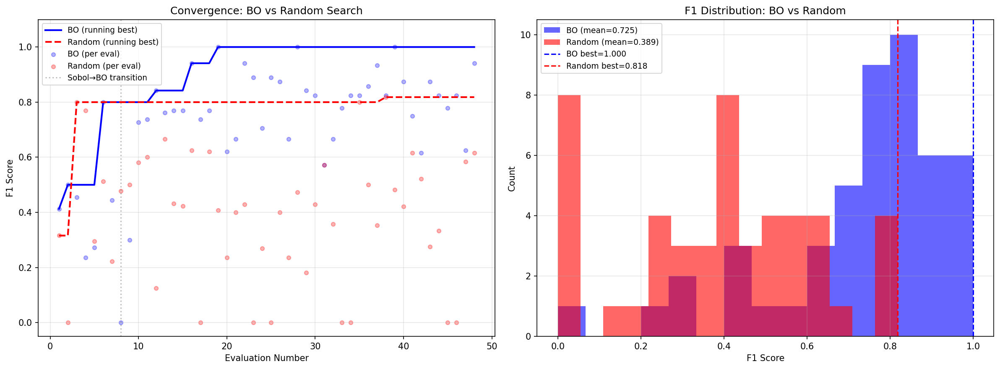
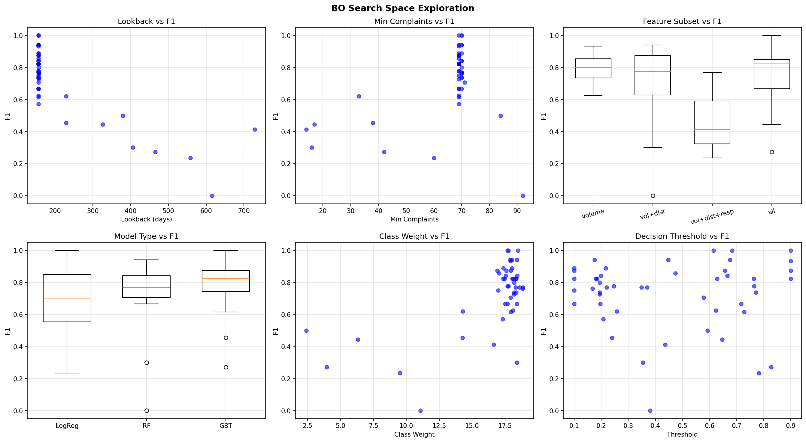

# CFPB Enforcement Action Predictor

An AI agent (Perplexity) autonomously built a Bayesian Optimization pipeline that predicts which companies the CFPB will take enforcement action against — using nothing but public consumer complaint data.

**The agent was told nothing about BoTorch.** It independently chose the library, selected MixedSingleTaskGP as the surrogate model, and used LogExpectedImprovement as the acquisition function.

Total cost: $200/month Perplexity Max subscription. No cloud compute, no GPU cluster, no research team.

## Results

| Metric | BO | Random Search |
|--------|-----|---------------|
| Mean F1 (48 evals) | **0.725** | 0.389 |
| Best F1 | 1.000 | 0.818 |
| Convergence | Eval ~19 | Never |

BO outperforms random search by **86%** across all evaluations.



## What BO Discovered

- **Short lookback wins.** Optimal window is ~156 days (~5 months). Longer windows hurt. The signal is recent complaint velocity, not cumulative volume.
- **Heavy class weighting is critical.** 18.5x upweighting of enforcement cases needed.
- **All features > subsets.** Volume + distribution + response + text + geographic together outperform any subset.
- **Model type barely matters.** LogReg, RF, and GBT all work when the pipeline config is right.



## Search Space (8 dimensions)

BO optimized the **entire research design**, not just model hyperparameters.

| Dimension | Type | Range |
|-----------|------|-------|
| lookback_days | continuous | [90, 730] |
| min_complaints | discrete | [5, 100] |
| class_weight_ratio | continuous | [1.0, 20.0] |
| threshold | continuous | [0.1, 0.9] |
| feature_subset | categorical | {volume, +distribution, +response, all} |
| model_type | categorical | {logistic_regression, random_forest, gradient_boosted} |
| text_features | categorical | {none, basic} |
| control_match_ratio | discrete | {1, 2, 3, 5} |

## Live Predictions (March 16, 2026)

The model currently scores these companies as highest risk:

| Company | Risk Score | Complaints |
|---------|-----------|------------|
| CL Holdings LLC | 0.9999 | 9,537 |
| SchoolsFirst Federal Credit Union | 0.9993 | 72 |
| State Employees Credit Union | 0.9989 | 288 |
| Synerprise Consulting Services, Inc. | 0.9983 | 121 |
| LexisNexis | 0.9915 | 11,567 |

Note: SchoolsFirst has only 72 complaints but scores 0.999. It's not volume — it's the distributional signature and response patterns.

**These are statistical patterns in public data, NOT accusations of wrongdoing.**

See [`predictions/`](predictions/) for the full dated risk list.

## Caveats

- **Small matched dataset.** Only 26 of 213 enforcement actions matched to complaint data via strict name matching. Fuzzy matching would 3-4x the positives.
- **Small test set.** 16 samples. F1=1.0 on best config is likely overfit. The mean across 48 evals is the real metric.
- **No temporal validation.** Train/test split is random, not chronological. A v2 should train on 2017-2021, test on 2022-2024.

## Reproduce

```bash
pip install botorch pandas scikit-learn matplotlib
python run_pipeline.py
